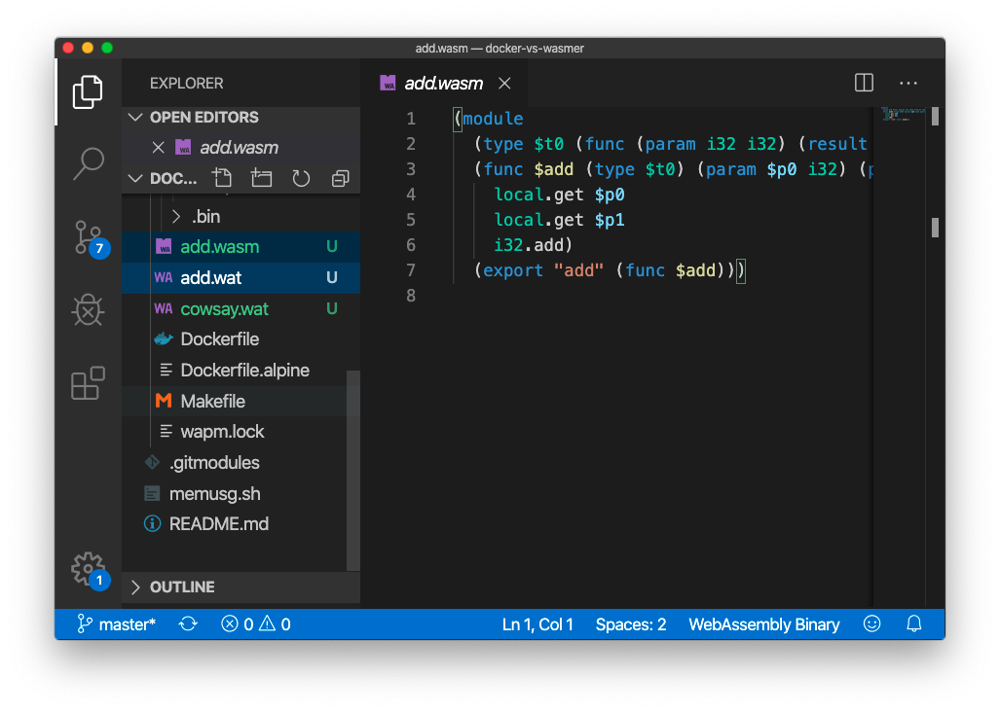
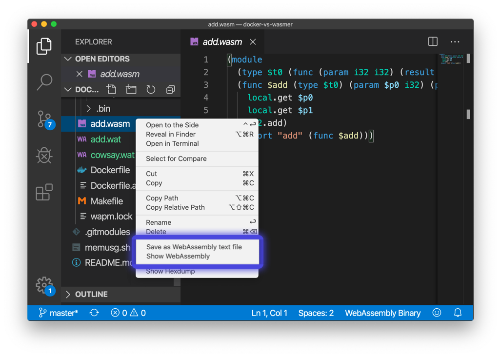

  
  
WebAssembly Toolkit for VSCode

  

    
  
  
  

## Features

* Syntax highlight for WebAssembly textual representation.
* Preview WebAssembly Binary files in 2 clicks.
* Fast convertion between text and binary view.

## License

MIT, 2019 (c) WebAssembly Foundation
